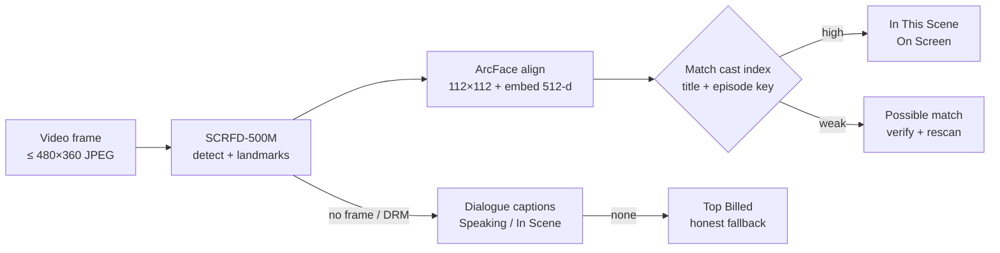

# WhosOnScreen 🎬

> **Prime Video X-Ray for the entire web — instantly identify who's on screen.**

[](https://developer.chrome.com/docs/extensions/mv3/intro/)
[](LICENSE)
[](manifest.json)
[](https://www.google.com/chrome/)
[](https://github.com/rohanrjoshii/WhosOnScreen/pulls)

**WhosOnScreen** is a lightweight Chrome (MV3) extension that brings **X-Ray-style actor identification** to **Netflix, JioHotstar, Prime Video, YouTube, and any HTML5 video player**.

Press `Alt+W` / `⌥W` or tap the floating **X-Ray** pill → the current frame is scanned, faces are matched against the title's cast, and a native dark-glass panel shows who's in the scene, with bios, filmography, and IMDb/TMDB links.

---

## Table of contents

- [Demo](#-demo)
- [Features](#-features)
- [How it works](#-how-it-works)
- [Project structure](#-project-structure)
- [Getting started](#-getting-started)
- [Settings](#-settings)
- [Privacy](#-privacy)
- [Scripts](#-scripts)
- [What's new in v0.3.0](#-whats-new-in-v030)
- [Limitations](#-limitations--drm-notes)
- [Contributing](#-contributing)
- [License](#-license)

---

## 🎥 Demo

> Tip for contributors: drop a 10–20s screen recording here (`docs/demo.gif`) showing `Alt+W` on a trailer + the panel + a song ID.

```
Alt+W  →  frame scan  →  “In This Scene”  →  actor detail  →  “What song is this?”
```

---

## ✨ Features

### ⚡ Zero-friction triggers
- **Hotkeys**: `Alt + W` (Win/Linux), `⌥W` / `⇧⌘W` (Mac) via capture-phase listeners
- **Floating X-Ray pill**: docks to the active player (`≥280×150`), auto-fades after 2.2s idle, re-anchors on scroll/resize, works in fullscreen
- **Auto-open on pause** (optional footer toggle): opens X-Ray when a long video is paused

### 🎯 Honest confidence tiers
| Tier | Header | Badge | Meaning |
| :--- | :--- | :--- | :--- |
| **High** | `IN THIS SCENE` | `ON SCREEN` | Face matched on camera (SCRFD + ArcFace, similarity + margin) |
| **Medium** | `SPEAKING IN SCENE` | `SPEAKING` / `IN SCENE` | Character matched from dialogue captions |
| **Fallback** | `MAIN CAST & LEADS` | `TOP BILLED` | No visual confirmation — scenery, DRM block, or capture failure |

A status line under the header always explains *why* you're seeing a result (e.g. “2 faces matched on camera”, “Matched from dialogue captions”, “Frame access is restricted”).

### 🧠 On-device face pipeline
- **SCRFD-500M** detection (boxes + 5-point landmarks) → **ArcFace** 112×112 alignment → **512-d embeddings**
- Runs in an isolated **offscreen document** on the **WASM** backend (no GPU required)
- Cast index is keyed by **title + TMDB media/episode**, cached in **IndexedDB (14-day TTL)**
- Frames travel as bounded **480×360 JPEG data URLs** (JSON-safe for MV3 messaging)
- Duplicate broadcasts are de-duplicated; stale title indexes are rejected

### 🎨 Native X-Ray UI
- Dark-glass right-edge panel, Shadow-DOM isolated, keyboard accessible (`Esc`, focus trap, ARIA live regions)
- Actor detail view: large portrait, age/birthplace, biography, “Known For”, IMDb/TMDB/Wiki links
- Inline title correction (`✎`), full-cast view, frame re-scan, responsive + reduced-motion support

### 🎵 Music in the scene
- “What song is this?” records a short tab sample **only when you press it** and sends it to **AudD**
- Requires your own **AudD API token** (Settings) — otherwise the feature stays disabled and uploads nothing
- MediaSession metadata is gated so movie titles aren't mistaken for songs; results are cached per origin + title + timestamp

---

## 🧭 How it works



1. **Content script** detects the title (Netflix / Prime / Hotstar / YouTube / generic), watches the active player, and samples captions.
2. **Service worker** fetches cast from TMDB, triggers offscreen cast indexing, and keeps per-tab pipeline state.
3. **Offscreen document** runs ONNX detection + embeddings and matches against the indexed cast.
4. **Overlay** renders the tier, status note, cast cards, music section, and detail views.

---

## 🗂 Project structure

```
manifest.json               # MV3 manifest (Chrome 120+, WASM CSP)
src/
  background/               # service worker, TMDB client, 2-tier cache
  content/                  # overlay UI, face engine, trackers, title detectors
    title-detectors/        # netflix / prime / hotstar / youtube / generic
  offscreen/                # SCRFD + ArcFace + cast index + audio ID
  options/                  # settings page (TMDB / AudD / auto-pause)
  shared/                   # messages, dialogue matcher, music cache
scripts/
  build.js                  # esbuild → dist/ (fails loudly if models missing)
  download-models.sh        # pinned + SHA-256-verified model fetch
  check.js / test.js        # syntax check + pure-logic smoke tests
dist/                       # built extension (load this in Chrome)
icons/  models/             # models/ is local-only, never committed
```

---

## 📥 Getting started

```bash
git clone https://github.com/rohanrjoshii/WhosOnScreen.git
cd WhosOnScreen
npm install
npm run download-models   # pinned revisions + SHA-256 check (~15 MB, local only)
npm run build             # outputs production bundle to dist/
```

Optional sanity checks:

```bash
npm run check   # syntax-check all source files
npm test        # pure-logic smoke tests (matcher + cache normalization)
```

Load in Chrome:

1. Open `chrome://extensions` → enable **Developer mode**
2. **Load unpacked** → select the `dist/` folder
3. Pin the extension, open any streaming site, press `Alt+W` / `⌥W`

> `dist/` JS/HTML is committed for easy loading; large binaries (`*.wasm`, `*.mjs`, `models/`) are intentionally git-ignored and regenerated by `npm run build`.

---

## ⚙️ Settings

Open via the ⚙️ button in the panel header or `chrome://extensions` → **Details** → **Extension options**:

| Setting | Purpose |
| :--- | :--- |
| **TMDB API token** | Full catalog search + bios/filmography (v4 Read Access Token recommended; legacy key also works) |
| **AudD API token** | Enables “What song is this?” (no token → no recording/upload) |
| **Auto-pause** | Auto-open X-Ray on long-video pause |
| **Clear cached data** | Purges metadata + music + face-embedding caches |

---

## 🔒 Privacy

- **Local-first**: frames are processed on-device; cast embeddings stay in extension-origin IndexedDB.
- **Opt-in audio**: tab audio is captured only after you press “What song is this?”, and only if an AudD token is configured.
- **No analytics**: no tracking, no remote logging.
- **Keys stay local**: tokens live in `chrome.storage.local` and can be wiped from Settings.

---

## 🧰 Scripts

| Command | What it does |
| :--- | :--- |
| `npm run build` | Production build → `dist/` (requires models + ORT assets) |
| `npm run dev` | Watch mode rebuild |
| `npm run download-models` | Fetch pinned ONNX models with checksum verification |
| `npm run check` | Node syntax check (24 source files) |
| `npm test` | Matcher + cache smoke tests |

---

## 🆕 What's new in v0.3.0

- Hardened ONNX path: JSON-safe JPEG transport, WASM CSP, Chrome 120+ baseline
- IndexedDB cast cache + title/media/episode index keys + stale-index guards
- Duplicate-inference suppression across content ↔ worker ↔ offscreen
- Real Settings page (TMDB / AudD / auto-pause / cache purge)
- Accessibility: focus trap, ARIA live status, keyboard cards, reduced-motion
- Music fixes: MediaSession gating, token pre-check, timeouts, no echo loopback
- Build diet: ships only the WASM runtime it uses (~73 MB → ~29 MB unpacked)
- Docs + `check`/`test` scripts for contributors

---

## ⚠️ Limitations & DRM notes

- **Widevine/DRM**: encrypted players can block canvas pixel reads → the UI says so and falls back to dialogue/top-billed leads.
- **Angles/lighting**: extreme profile, silhouette, and heavy occlusion may not register as frontal faces.
- **TMDB**: cast/bio/poster coverage depends on TMDB; without a token only bundled demo titles resolve fully.
- **Models**: review upstream model licenses before redistribution.

---

## 🤝 Contributing

PRs welcome! Quick loop:

```bash
npm install
npm run download-models
npm run check && npm test
npm run build
```

Please keep PRs focused, update `README` when behavior changes, and avoid committing `models/`, `*.wasm`, or `node_modules/`.

---

## 📄 License

Distributed under the MIT License. See [LICENSE](LICENSE) for more information.
